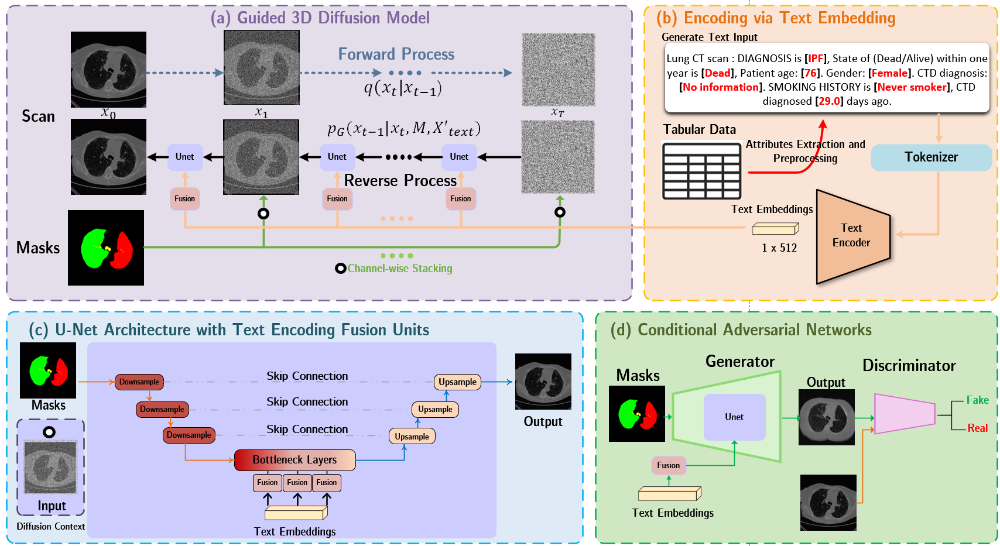
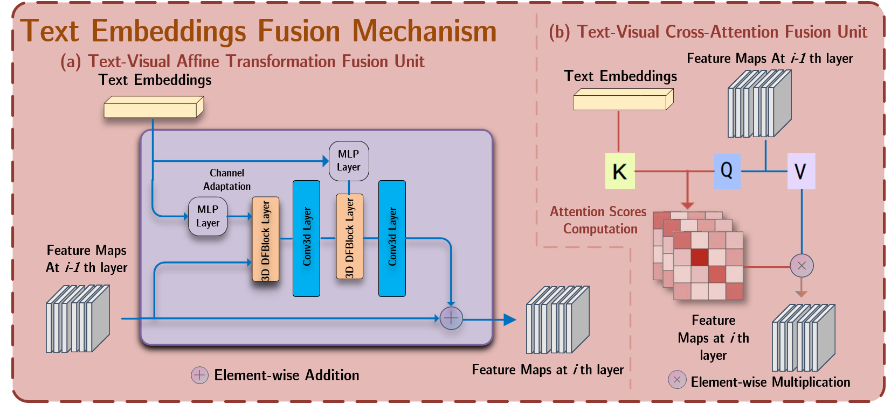
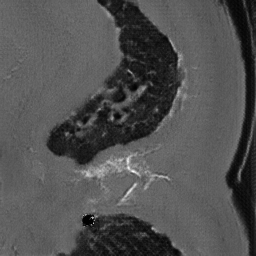
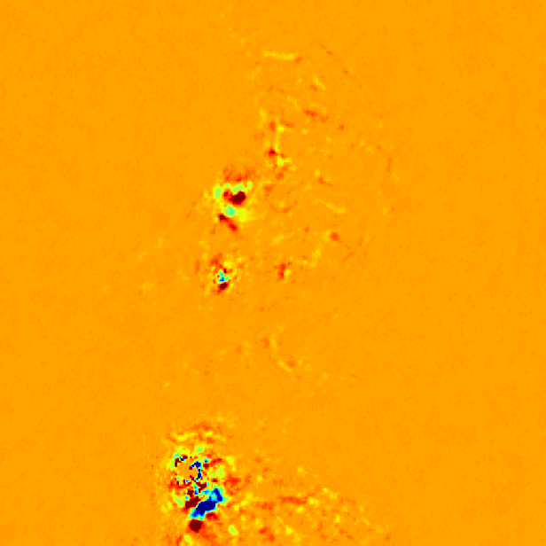
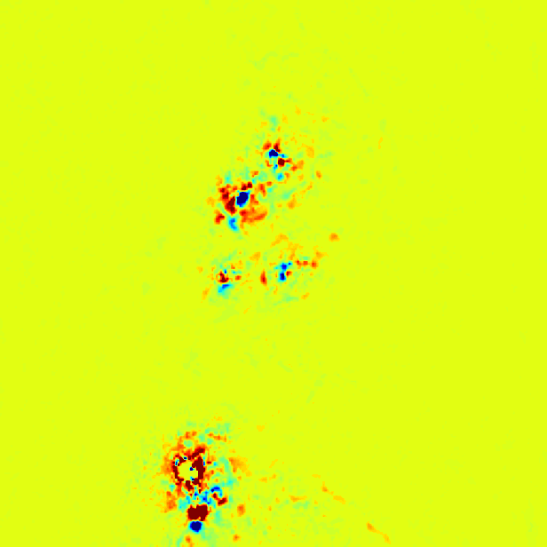
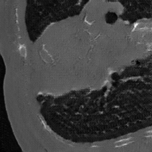
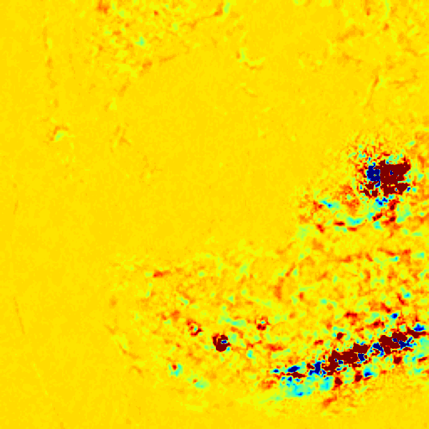

# Deep Generative Models Unveil Patterns in Medical Images Through Vision- ”Language” Conditioning

This is the official implementation of [the workshop paper](https://arxiv.org/abs/2410.13823)


## Abstract 

Deep generative models have significantly advanced medical
imaging analysis by enhancing dataset size and quality. Beyond mere
data augmentation, our research in this paper highlights an additional,
significant capacity of deep generative models: their ability to reveal and
demonstrate patterns in medical images. We employ a generative structure
with hybrid conditions, combining clinical data and segmentation
masks to guide the image synthesis process. Furthermore, we innovatively
transformed the tabular clinical data into textual descriptions. This ap-
approach simplifies the handling of missing values and also enables us to
leverage large pre-trained vision-language models that investigate the
relations between independent clinical entries and comprehend general
terms, such as gender and smoking status. Our approach differs from and
presents a more challenging task than traditional medical report-guided
synthesis due to the less visual correlation of our clinical information
with the images. To overcome this, we introduce a text-visual embed-
ding mechanism that strengthens the conditions, ensuring the network
effectively utilizes the provided information. Our pipeline is generalizable
to both GAN-based and diffusion models. Experiments on chest CT, par-
particularly focusing on the smoking status, demonstrated a consistent in-
tensity shift in the lungs which is in agreement with clinical observations,
indicating the effectiveness of our method in capturing and visualizing
the impact of specific attributes on medical image patterns. Our meth-
ods offer a new avenue for the early detection and precise visualization
of complex clinical conditions with deep generative models. 
 

## Model Pipelines and Fusion Graphical illustration:




##  Illustrative Cases Demonstrating the Impact of Altered Prompt Content on Prediction Outcomes.


<table>
  <tr>
    <td align="center">
      <strong>(Default)Age: 68 Smoker:No</strong><br>
      
    </td>
    <td align="center">
      <strong>Age: 24 Smoker:No</strong><br>
      
    </td>
    <td align="center">
      <strong>Difference in Voxel Values: Age</strong><br>
      
    </td>
    <td align="center">
      <strong>Age: 68 Smoker:yes</strong><br>
      
    </td>
    <td align="center">
      <strong>Difference in Voxel Values: Smoker No or Yes</strong><br>
      
    </td>
  </tr>
</table>

<table>
  <tr>
    <td align="center">
      <strong>(Default)Age: 86 Smoker:Yes</strong><br>
      
    </td>
    <td align="center">
      <strong>Age: 24 Smoker:Yes</strong><br>
      
    </td>
    <td align="center">
      <strong>Difference in Voxel Values: Age</strong><br>
      
    </td>
    <td align="center">
      <strong>Age: 86 Smoker:No</strong><br>
      
    </td>
    <td align="center">
      <strong>Difference in Voxel Values: Smoker No or Yes</strong><br>
      
    </td>
  </tr>
</table>


## More Examples

<table>
  <tr>
    <td align="center">
      <strong>Ex1: (Default)Patient Status: Alive</strong><br>
      
    </td>
    <td align="center">
      <strong>Patient Status: Dead</strong><br>
      
    </td>
    <td align="center">
      <strong>Difference in Voxel Values: Dead/Alive</strong><br>
      
    </td>
  </tr>
</table>

<table>
  <tr>
    <td align="center">
      <strong>Ex2:(Default)Patient Status: Dead</strong><br>
      
    </td>
    <td align="center">
      <strong>Patient Status: Alive</strong><br>
      
    </td> 
    <td align="center">
      <strong>Difference in Voxel Values: Dead/Alive</strong><br>
      
    </td> 
  </tr>
</table>

<table>
  <tr>
    <td align="center">
      <strong>Ex3:(Default)DIAGNOSIS CODE: CTD-ILD</strong><br>
      
    </td>
    <td align="center">
      <strong>DIAGNOSIS CODE: IPF</strong><br>
      
    </td> 
    <td align="center">
      <strong>Difference in Voxel Values: CTD-ILD vs IPF</strong><br>
      
    </td> 
        <td align="center">
      <strong>DIAGNOSIS CODE: UILD</strong><br>
      
    </td> 
    <td align="center">
      <strong>Difference in Voxel Values: CTD-ILD vs UILD </strong><br>
      
    </td> 
    <td align="center">
      <strong>Difference in Voxel Values: IPF vs UILD </strong><br>
      
    </td> 
  </tr>
</table>

<table>
  <tr>
    <td align="center">
      <strong>Ex4:(Default)DIAGNOSIS CODE: CTD-ILD</strong><br>
      
    </td>
    <td align="center">
      <strong>DIAGNOSIS CODE: IPF</strong><br>
      
    </td> 
    <td align="center">
      <strong>Difference in Voxel Values: CTD-ILD vs IPF</strong><br>
      
    </td> 
        <td align="center">
      <strong>DIAGNOSIS CODE: UILD</strong><br>
      
    </td> 
    <td align="center">
      <strong>Difference in Voxel Values: CTD-ILD vs UILD </strong><br>
      
    </td> 
    <td align="center">
      <strong>Difference in Voxel Values: IPF vs UILD </strong><br>
      
    </td> 
  </tr>
</table>


<table>
  <tr>
    <td align="center">
      <strong>Ex5:(Default)DIAGNOSIS CODE: CTD-ILD</strong><br>
      
    </td>
    <td align="center">
      <strong>DIAGNOSIS CODE: IPF</strong><br>
      
    </td> 
    <td align="center">
      <strong>Difference in Voxel Values: CTD-ILD vs IPF</strong><br>
      
    </td> 
        <td align="center">
      <strong>DIAGNOSIS CODE: UILD</strong><br>
      
    </td> 
    <td align="center">
      <strong>Difference in Voxel Values: CTD-ILD vs UILD </strong><br>
      
    </td> 
    <td align="center">
      <strong>Difference in Voxel Values: IPF vs UILD </strong><br>
      
    </td> 
  </tr>
</table>


 


## Highlight

 

- 1) **Conversion of Tabular Data into Text** This method efficiently addresses missing data issues and capitalizes on the capabilities of pre-trained vision-language models to decode clinical information;
- 2) **Advanced Text Fusion Techniques**: We introduced techniques, including a cross-attention module and an Affine transformation fusion unit, to refine the conditioning process in cases where clinical information does not directly correspond to visual cues in images; and 
- 3) **General Implementation for GAN and Diffusion Models** 

## Requirements

apex==0.9.10dev

dominate==2.9.1

matplotlib==3.8.2

MedCLIP==0.0.3

monai==1.3.0

nibabel==5.2.1

numpy==1.26.4

pandas==2.2.1

Pillow==10.0.1

Pillow==10.2.0

pytorch_msssim==1.0.0

scikit_learn==1.4.0

scipy==1.12.0

SimpleITK==2.3.1

SimpleITK==2.3.1

tensorflow==2.15.0.post1

torch==2.1.2

torchmetrics==1.3.1

torchvision==0.16.2

tqdm==4.65.0


<!-- ## Citation

This repository is based on:

pix2pixHD: High-Resolution Image Synthesis and Semantic Manipulation with Conditional GANs ([code](https://github.com/NVIDIA/pix2pixHD) and 
[paper](https://arxiv.org/abs/1711.11585));

Paper Link:

https://arxiv.org/abs/2203.05564 \
https://ieeexplore.ieee.org/document/9735339

Please cite:

```
@ARTICLE{9735339,
  author={Xing, Xiaodan and Del Ser, Javier and Wu, Yinzhe and Li, Yang and Xia, Jun and Lei, Xu and Firmin, David and Gatehouse, Peter and Yang, Guang},
  journal={IEEE Journal of Biomedical and Health Informatics}, 
  title={HDL: Hybrid Deep Learning for the Synthesis of Myocardial Velocity Maps in Digital Twins for Cardiac Analysis}, 
  year={2022},
  volume={},
  number={},
  pages={1-1},
  doi={10.1109/JBHI.2022.3158897}}
``` -->
